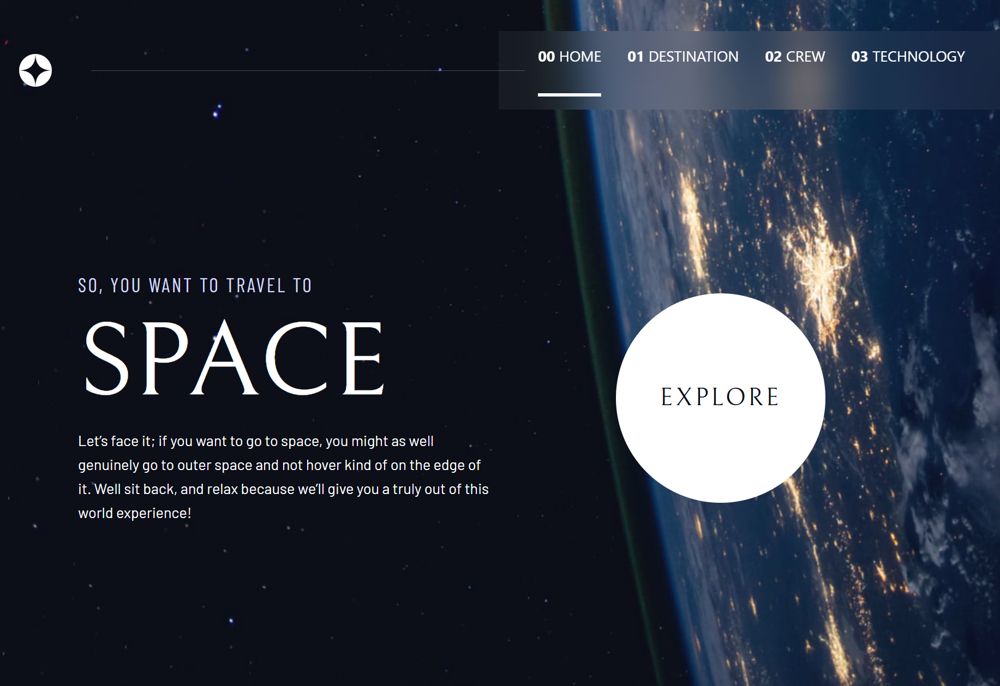

# Frontend Mentor - Space tourism website

This is a solution to the [Space tourism website challenge on Frontend Mentor](https://www.frontendmentor.io/challenges/space-tourism-multipage-website-gRWj1URZ3). Frontend Mentor challenges help you improve your coding skills by building realistic projects.

## The challenge

Your users should be able to:

- View the optimal layout for each of the website's pages depending on their device's screen size
- See hover states for all interactive elements on the page
- View each page and be able to toggle between the tabs to see new information

### Screenshot

### Links

- Solution URL: https://github.com/annolangen/gem-space
- Live Site URL: https://annolangen.github.io/gem-space/index.html

## My process

This was a vibe coding excercise. I did as little editing of source files as possible, and focused on prompting Gemini to produce the correct code. I used both chat and agent modes. My specific contributions were:

- the inital project setup with Parcel, TypeScript, lit-html, and TailwindCSS
- intervening after multiple failures to get the horizontal line to continue into the navigation links on the home page
- fixing the image paths that Gemini kept getting wrong
- fixing the TailwindCSS configuration to use the idiomatic `@theme` block in `index.css` instead of `tailwind.config.js`
- fixing the Parcel build errors related to asset and module resolution

Part of my prompting strategy was to have Gemini write plans and designs for itself, which it then followed. These are included as `PLAN.md` and `design.md`. This helped pick up work from a previous session. Most of this README was also generated by Gemini, based on the contents of those files.

### Built with

- TypeScript - For type safety and improved code quality.
- lit-html - A lightweight and efficient templating library.
- TailwindCSS - A utility-first CSS framework for all styling.
- Parcel - A zero-configuration web application bundler.
- Flexbox & CSS Grid - For creating responsive layouts.
- Mobile-first workflow

### What I learned

This project was an exercise in building a modern, interactive website with a minimal technology stack, avoiding the overhead of a large framework. The key architectural decisions are documented in `design.md`, but here are some highlights:

**Minimalist Architecture**: We chose `lit-html` for its lightweight and efficient templating. For a project of this scale, it provided the benefits of component-based templates without the complexity of a full framework like React or Vue.

**Simple and Effective State Management**: We intentionally avoided a dedicated state management library. Instead, state is handled in two ways:

1.  **URL-based State**: The main application state (which page is visible) is stored in the URL hash (`#`), making the application's state bookmarkable and shareable.
2.  **DOM-based State**: UI-specific state (like the mobile menu's visibility) is stored directly in the DOM as CSS classes.

**Idiomatic Tailwind Configuration**: We fully embrace Tailwind's utility-first philosophy by defining our design system—including custom colors, fonts, and responsive background images—directly within the `index.css` file using the `@theme` at-rule. This is the standard approach for Tailwind CSS v4, and it centralizes our design tokens, allowing Tailwind to generate all necessary utility classes which are then applied directly in the `lit-html` templates. This avoids custom CSS for layout patterns and keeps the styling logic co-located with the markup.

### Continued development

The current architecture is well-suited for this project's scope. However, as outlined in `design.md`, we would re-evaluate our technology choices if the project's complexity were to increase. Future areas of focus could include:

- Migrating to a full-featured framework like Next.js or SvelteKit if the application required more complex state management.
- Integrating with a headless CMS for dynamic content.
- Adding more complex page transitions and animations with a dedicated library like GSAP or Framer Motion.

## Author

- Website - Your Name
- Frontend Mentor - @yourusername
